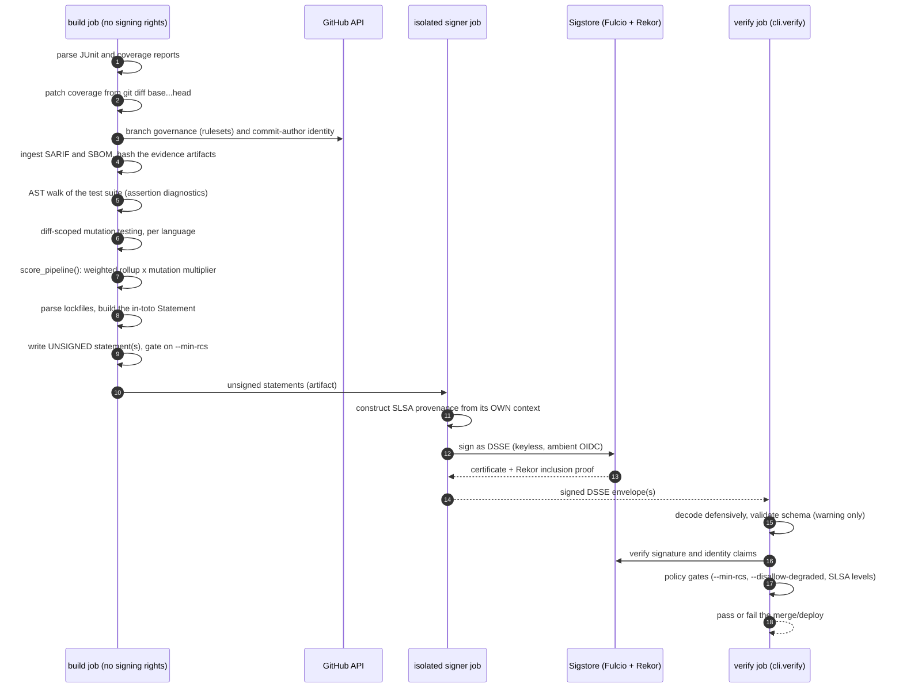
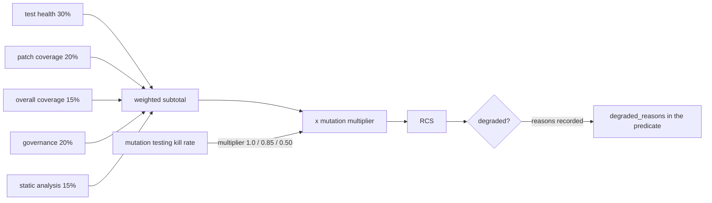

# Architecture

The mental model, the rules that must not be broken, and where things live.
For flags, scoring tables and the predicate shape see [`README.md`](README.md);
for day-to-day workflow see [`CONTRIBUTING.md`](CONTRIBUTING.md).

## 1. Executive overview

A CI run produces signals: test results, coverage, static-analysis findings,
the repository's branch protection, a dependency lockfile. On their own they
are just log output. Lucid Assay turns them into **evidence someone else can
verify without trusting the pipeline that produced it**:

1. **Score.** A deterministic Release Confidence Score (RCS), 0-100, built from
   real measured inputs. Almost every edge case fails *closed*: zero tests
   executed scores 0, missing patch coverage falls back to a discounted overall
   figure and flags the run `degraded`.
2. **Attest.** The score and its evidence are assembled into an in-toto
   Statement whose predicate embeds each component's reason text verbatim, so an
   auditor never has to reverse-engineer a number.
3. **Sign.** The statement is wrapped in a DSSE envelope and signed with
   Sigstore keyless signing, tied to the CI run's own OIDC identity.
4. **Gate.** A standalone admission gate (`cli/verify.py`) checks the signed
   envelope against policy before a merge or deploy is allowed.

It ships as one CLI (`lucid`, alias `lucid-assay`; `plinth`/`plinth-assay` are
kept as backwards-compatible aliases from before the rebrand) and a container
image.

Where it sits: `lucid-assay` is the **producer and gatekeeper** in the Lucid
chain. A separate, isolated signer (`lucid-attest-service`'s `sign-client.yml`)
does the signing, and `lucid-dsse-collector` stores and serves the signed
result. Assay never trusts a previous stage's claim about itself; each stage
re-checks what it is handed.

## 2. Data flow

### 2a. One CI run, end to end

The numbered comments (`# 1.` ... `# 10.`) in `cli/main.py::main()` are the
canonical map of this flow. The build job **never** holds signing rights; the
only job with `id-token: write` is the signer.

### 2b. How the score is composed

Mutation testing is deliberately a **multiplier**, not a sixth additive bucket:
coverage and assertion counts can both be satisfied by a test that runs a line
without checking its behaviour, so a low kill rate must *discount* the credit
coverage and test health earned, not sit beside it. The weights live in
`cli/scorer.py`'s `WEIGHTS` and the README's scoring table; change both
together.

## 3. The non-negotiable invariants

**1. Ground truth only.** Never hardcode, mock or synthesize provenance data,
SLSA levels or attestation payloads in `cli/`. Every signal, hash and check
result comes from real inputs. Synthetic payloads live only in `tests/`.

**2. Fail closed.** Missing, unverified or tampered metadata makes a check
evaluate to `false` or non-compliant. Never default to a passing state and
never fabricate a fallback signature. An unconfirmed state is never treated the
same as a confirmed good one (for example, `--disallow-degraded` blocks a run
whose `degraded` field was simply absent).

**3. `parsers/*` and `scorer.py` are pure.** No network, no side effects. This
is what the adversarial suites hammer on. The only network-touching code is
`oidc_signer.py`, the WORM upload, and the GitHub API parsers
(`github_rules.py`, `commit_author.py`, `s2c2f.py`'s API-backed checks), each
fail-closed on any error.

**4. Each component's `reason` is embedded verbatim in the signed predicate.**
A score must be explainable from the attestation alone.

**5. Signing goes through the library, not the CLI.** `oidc_signer.py` calls
Sigstore's `Signer.sign_dsse()` directly. The `sigstore` CLI's `sign` produces a
hashedrekord bundle that `Verifier.verify_dsse()` rejects, and `sigstore attest`
restricts predicate types and derives its own subject. Do not reintroduce a CLI
subprocess. It raises rather than silently falling back to an unsigned artifact.

**6. Provenance is built where it can be trusted.** The build job is untrusted
by design. SLSA provenance is constructed inside the isolated signer job from
that job's own ambient context; the only values it accepts from the build job
are the subject name and digest. That is what makes the Build Level 3 identity
checks in `verify` meaningful.

**7. The admission gate reports, it doesn't crash.** `verify` decodes defensively
(size-checked before reading, never raising on malformed input) and distinguishes
Sigstore identity `verified` / `skipped` / `unavailable` / `failed`. Only
`failed` (an explicit rejection) blocks. `unavailable` (offline, no trust root)
is a warning. A dry-run or placeholder signature is `skipped`, never mistaken for
a real one.

**8. `--disallow-degraded` is `reason_code`-aware.** Each degradation trigger has
its own reason code, and the gate only lets a degraded run pass when every entry
is in `_ALLOWED_DEGRADED_REASONS` (`cli/verify.py`). Adding a trigger means giving
it its own code and deciding, deliberately, whether the gate exempts it. A
guardrail test forces that decision: every reason-code constant must appear in
exactly one of the allowed or deliberately-blocked sets.

**9. `schema_validation_status` never gates.** The predicate schema evolves and
fields are added after real attestations exist without them, so a mismatch is a
warning only.

**10. Diagnostics first.** A policy violation or auth failure must fail closed
*and* say exactly what is wrong and how to fix it: expected vs. actual values,
the specific permission needed. A bare status code is not enough.

**11. Informational sections stay informational.** Several report sections (S2C2F
matrix, most repository-governance items, dependency materialization, some SLSA
levels) have no gate flag on purpose. Wiring one into `passed` or the exit code is
its own decision, not a side effect. Gate flags are opt-in and off by default
(`--require-slsa-build-l3`, `--require-commit-signing`, `--require-mutation-score`).

**12. Documentation is part of the change.** A PR that changes CLI flags, the
predicate schema, degraded reasons or admission rules is not done until
`README.md` reflects it.

**13. Functional verification is scored per tier, and deferred work is never hidden.**
`predicate.functional_verification` scores a caller's declared journeys at the
stage they must be proven at: `ci` journeys at build time, `cd` journeys after
deploy, `both` at each. The other tier's journeys come back as `deferred`, so a
100% at one stage cannot hide work still owed at the other. An invalid contract
(bad or duplicate id, missing or unknown tier) is reported as `config_invalid`
and never silently repaired, since dropping an entry would shrink the
denominator. Legacy flat-contract output stays byte-identical. Test <-> journey
is many-to-many by construction: a test carries a *set* of `@cuj` tags, and a
journey is covered when at least one tagged test passed and none failed.

**14. Per-test results are bounded and carry no captured output.**
The same block carries a `tests` list (name, class, status, duration, a
truncated failure message, journey tags) so a consumer can show which tests ran
and why one failed. It is capped (1000 rows, failed first, so a cap only ever
drops passing tests) with exact totals always in `metrics` and `tests_truncated`
saying when it is a subset. `message` is only ever the report's own `message`
attribute -- never a traceback or `<system-out>`/`<system-err>`, which can carry
secrets from the run's environment -- and it is single-line, control-character
free and length-capped. A test asserts a planted secret never reaches the output.

## 4. Directory architecture

| Path | Owns |
|---|---|
| `cli/main.py` | The pipeline orchestrator and CLI entry point. Its numbered comments are the flow map. |
| `cli/scorer.py` | `score_pipeline()` and `WEIGHTS`. Pure. Defines every `DEGRADED_REASON_*` code. |
| `cli/builder.py` | Assembles the in-toto Statement and the predicate. |
| `cli/verify.py` | The admission gate: envelope decode, Sigstore identity, policy gates, SLSA Source and Build checklists, the text/JSON/step-summary reports. |
| `cli/oidc_signer.py` | Keyless signing via the Sigstore library. One of the few network-touching modules. |
| `cli/sign.py`, `cli/provenance.py`, `cli/slsa_provenance.py` | The isolated-signer subcommand and SLSA v1.0 provenance construction. |
| `cli/patch_coverage.py` | `git diff base...head` intersected with coverage hit maps. Also the diff every mutation and SARIF scope reuses. |
| `cli/parsers/` | Pure input parsers: JUnit, coverage (Cobertura, LCOV, JaCoCo), SARIF, SBOM, lockfiles, functional adequacy, S2C2F. `github_rules.py` and `commit_author.py` are the GitHub-API-backed ones. |
| `cli/parsers/ast/` | Multi-language test-assertion diagnostics (Python via stdlib `ast`; TS/JS, Go, Java via Tree-sitter). Uses *scoped* visitors, never `ast.walk()` inside a test function. |
| `cli/mutation/` | Diff-scoped mutation testing: a dispatcher plus one runner per language (mutmut, Stryker, PIT, gremlins). A missing tool degrades to `unavailable`, never a crash. |
| `cli/functional.py` | The standalone `functional-adequacy` subcommand. Its scoring lives in `parsers/functional_adequacy.py`. |
| `cli/sbom_statement.py`, `cli/sarif_statement.py` | Companion in-toto statements carrying the raw SBOM and SARIF documents verbatim. |
| `schema/` | The predicate JSON Schema. Needs `__init__.py` and `package-data` to be installed (see `CONTRIBUTING.md`). |
| `.lucid/` | This repo's own dogfooding config (`denylist.json`, `license-curations.json`). |
| `tests/` | Unit, adversarial and boundary suites. See `CONTRIBUTING.md`. |
| `.github/workflows/assay.yml` | The dogfooding pipeline: build, attest, verify, publish. |
| `Dockerfile` | The published CLI image, built once and promoted by digest. |
| `contrib/` | Archived mirror of the retired `lucid-attest` signer repo, kept for history. Not the current signer (that is `lucid-attest-service`'s `sign-client.yml`). |
